# DataModelling Crew — Data Transformation & ML Pipeline

An AI-powered data transformation and machine learning pipeline built with [CrewAI](https://crewai.com). This project uses two specialized AI agents working sequentially to clean, transform, and model tabular datasets — from raw CSV to a fully evaluated ML model report.

The **Data Transformation Agent** profiles the dataset, handles feature engineering and correlation analysis, and the **Machine Learning Agent** trains and evaluates XGBoost and Decision Tree classifiers (with and without hyperparameter tuning) across multiple feature sets.

---

## Architecture Overview

The pipeline is orchestrated by a **CrewAI Flow** (`ContentFlow`) that kicks off a **sequential Crew** of two agents. Below are the process diagrams for each agent.

### Data Transformation Agent

```mermaid
%%{init: {'theme':'base', 'themeVariables': {'fontSize': '22px'}, 'flowchart': {'nodeSpacing': 45, 'rankSpacing': 70, 'curve': 'basis'}}}%%
flowchart LR
    subgraph AGENT1 [Data Transformation Agent]
        direction LR
        START([Start]) --> LOAD_DATA[Load dataset]
        LOAD_DATA --> STEP1[Describe data]
        STEP1 --> STEP2[Read description]
        STEP2 --> EXCLUDE{Identify features to exclude}
        EXCLUDE --> ASK_USER[Ask user to drop]
        ASK_USER --> USER_DEC{Confirmed?}
        USER_DEC -->|Yes| DROP[Drop features]
        USER_DEC -->|No| KEEP[Keep features]
        DROP --> TRANSFORM{Need one-hot?}
        KEEP --> TRANSFORM
        TRANSFORM -->|Yes| OHE[Apply OHE]
        TRANSFORM -->|No| CORREL[Correlation]
        OHE --> CORREL
        CORREL --> HIGH_CORR[Find highest correlation]
        HIGH_CORR --> DESCRIBE_NEW[Describe transformed data]
        DESCRIBE_NEW --> PICK_SETS[Pick 3 feature sets]
        PICK_SETS --> WRITE_MD[Write summary + JSON]
    end

    WRITE_MD --> CHECK_FAIL{Any step failed?}
    CHECK_FAIL -->|Yes| REPORT_MGR[Report to manager]
    REPORT_MGR --> END_FAIL([Process failed])
    CHECK_FAIL -->|No| END_SUCCESS([Output to Agent 2])

    classDef dataPrep fill:#d9eaf7,stroke:#5e8ab4,stroke-width:2px,color:#1e3a5f
    classDef decision fill:#fff0d6,stroke:#c47f2e,stroke-width:2px,color:#7a4d1a
    classDef failure fill:#ffe0d9,stroke:#bf5b3a,stroke-width:2px,color:#8b3c1c
    classDef terminal fill:#ede2f7,stroke:#7b5aa6,stroke-width:2px,color:#3e2c59,font-weight:bold
    classDef handoff fill:#e8e8e8,stroke:#9e9e9e,stroke-width:2px,color:#555555

    class STEP1,STEP2,DROP,KEEP,OHE,CORREL,HIGH_CORR,DESCRIBE_NEW,PICK_SETS,WRITE_MD dataPrep
    class EXCLUDE,USER_DEC,TRANSFORM,CHECK_FAIL decision
    class REPORT_MGR failure
    class START,END_FAIL,END_SUCCESS terminal
    class LOAD_DATA handoff
    class ASK_USER decision

    style AGENT1 stroke-dasharray: 5 5, stroke:#7f8c8d, stroke-width:3px, fill:#faf9f7
```



### Machine Learning Agent

```mermaid
%%{init: {'theme':'base', 'themeVariables': {'fontSize': '22px'}, 'flowchart': {'nodeSpacing': 45, 'rankSpacing': 70, 'curve': 'basis'}}}%%
flowchart LR
    subgraph AGENT2 [Machine Learning Agent]
        direction RL
        INPUT[Receive from Agent 1] --> READ_SUMMARY[Read summary.md]
        READ_SUMMARY --> SMALL_SET[Pick smallest feature set]
        SMALL_SET --> RUN_MODEL[Run ML model]
        RUN_MODEL --> EVAL[Assess strengths/weaknesses]
        EVAL --> NEXT_SET{More sets?}
        NEXT_SET -->|Yes| SMALL_SET
        NEXT_SET -->|No| RESULTS_OK{Results desired?}
        RESULTS_OK -->|No| TRY_OTHER[Try other combos]
        TRY_OTHER --> RUN_MODEL
        RESULTS_OK -->|Yes| CHECK_BALANCE{Balancing needed?}
        CHECK_BALANCE -->|Yes| STUDY_BALANCE[Study balancing]
        STUDY_BALANCE --> WRITE_FINAL[Write modelling_summary.md]
        CHECK_BALANCE -->|No| WRITE_FINAL
    end

    WRITE_FINAL --> CHECK_FAIL2{Any step failed?}
    CHECK_FAIL2 -->|Yes| REPORT_MGR2[Report to manager]
    REPORT_MGR2 --> END_FAIL([Process failed])
    CHECK_FAIL2 -->|No| END_SUCCESS([Process closed])

    classDef mlTask fill:#d8f0e6,stroke:#388e6f,stroke-width:2px,color:#1e4a3b
    classDef decision fill:#fff0d6,stroke:#c47f2e,stroke-width:2px,color:#7a4d1a
    classDef failure fill:#ffe0d9,stroke:#bf5b3a,stroke-width:2px,color:#8b3c1c
    classDef terminal fill:#ede2f7,stroke:#7b5aa6,stroke-width:2px,color:#3e2c59,font-weight:bold
    classDef handoff fill:#e8e8e8,stroke:#9e9e9e,stroke-width:2px,color:#555555

    class READ_SUMMARY,RUN_MODEL,EVAL,TRY_OTHER,STUDY_BALANCE,WRITE_FINAL mlTask
    class NEXT_SET,RESULTS_OK,CHECK_BALANCE,CHECK_FAIL2 decision
    class REPORT_MGR2 failure
    class END_FAIL,END_SUCCESS terminal
    class SMALL_SET mlTask
    class INPUT handoff

    style AGENT2 stroke-dasharray: 5 5, stroke:#7f8c8d, stroke-width:3px, fill:#faf9f7
```



---

## Agents

### 1. Data Transformation Agent (`data_transformation_a`)

**Role:** Prepares the dataset for machine learning by profiling, cleaning, encoding, and analysing correlations.

**Pipeline steps:**
1. **Describe dataset** — profiles each column (dtype, unique values, nulls, random samples)
2. **Read dataset description** — loads background context from a provided `dataset_description.txt`
3. **Identify features to exclude** — flags columns with no predictive value, asks user for confirmation before dropping
4. **One-hot encoding** — transforms categorical features (excludes continuous features and target)
5. **Correlation analysis** — computes association between all features and the target using Theil's U (categorical) / Pearson (numeric), with dython fallback
6. **Select 3 feature sets** — picks progressively larger feature sets ranked by correlation strength
7. **Write summary** — outputs `transformation_summary_{datetime}.md` with findings, dataset path, and feature sets as JSON

**Tools:** `describe_dataset_tool`, `drop_columns_tool`, `one_hot_encoding_tool`, `correlation_tool`, `FileReadTool`, `FileWriterTool`

### 2. Machine Learning Agent (`machine_learning_a`)

**Role:** Trains and evaluates ML models on each feature set produced by the Data Transformation Agent.

**Pipeline steps:**
1. **Read transformation summary** — loads the feature sets and dataset path from the transformation output
2. **Run ML models** — for each feature set, trains:
   - XGBoost (default + hyperparameter-tuned via Ax)
   - Decision Tree (default + hyperparameter-tuned via Ax)
3. **Evaluate** — metrics per model:
   - AUC-ROC, F1-score, Sensitivity (Recall), Accuracy
   - 5-fold Stratified Cross-Validation with mean ± std
   - Holdout test set (70/30 stratified split)
4. **Iterate** — runs all 3 feature sets (and optionally tries other combinations)
5. **Assess data balancing** — checks whether class imbalance correction is needed based on results
6. **Write final report** — outputs `modelling_summary_{datetime}.md` with findings, comparisons, and recommendations

**Tools:** `prediction_tool`, `FileReadTool`, `FileWriterTool`

### 3. Manager Agent (optional, defined in YAML)

Supervisory agent that coordinates the workflow and receives failure reports if any step fails. Available for hierarchical process mode.

---

## Custom Tools

| Tool | Description |
|------|-------------|
| `describe_dataset_tool` | Profiles a CSV: total rows/columns, null analysis, per-column dtype/unique values/random samples |
| `drop_columns_tool` | Drops specified columns from a CSV and saves the cleaned version |
| `one_hot_encoding_tool` | Applies OneHotEncoder to categorical columns, preserves target and continuous features, saves encoded dataset |
| `correlation_tool` | Computes association between target and all features (Theil's U / Pearson), excludes specified columns |
| `prediction_tool` | Runs full ML pipeline: XGBoost + Decision Tree with and without hyperparameter tuning, CV + holdout evaluation |
| `ask_user` | Prompts the user for input inline (used for drop confirmation) |

### ML Models

The `prediction_tool` wraps the `prediction` class (`src/data_modelling/tools/new_tools.py`):

- **XGBoost** — default parameters + hyperparameter-tuned (via Ax optimization, 10 trials)
- **Decision Tree** — default parameters + hyperparameter-tuned (via Ax optimization, 10 trials)
- **Cross-validation** — 5-fold StratifiedKFold for all four model variants
- **Evaluation** — AUC-ROC, F1-score, Sensitivity (Recall), Accuracy on holdout set (30%)

---

## Flow Structure

The project uses a **CrewAI Flow** (`ContentFlow`) to orchestrate the crew:

```python
class ContentFlow(Flow[ContentState]):
    @start()
    def run_cleaning_crew(self):
        # Kicks off ContentCrew with dataset path, goal, hard rules
        result = ContentCrew().crew().kickoff(inputs=crew_input)

    @listen(run_cleaning_crew)
    def on_crew_complete(self, crew_result):
        # Post-process step
```

The crew runs in `sequential` mode: Data Transformation Agent → Machine Learning Agent.

---

## Installation

**Requirements:** Python >=3.10, <3.14. This project uses [UV](https://docs.astral.sh/uv/) for dependency management.

```bash
# Install UV (if not already installed)
pip install uv

# Install project dependencies
crewai install
```

### Environment Variables

Copy `.env.example` to `.env` (or edit the existing `.env`) and add your API keys:

```
DEEPSEEK_API_KEY=sk-...         # Required — all agents use DeepSeek Chat
OPENAI_API_KEY=sk-...           # Fallback / alternative LLM
```

The agents use **DeepSeek Chat** (`deepseek-chat`) via API as their LLM. Configuration is in `src/data_modelling/crew.py`.

---

## Usage

```bash
# Run the full pipeline
crewai run
```

Or equivalently:

```bash
uv run python -m data_modelling.main
```

The flow:
1. Reads the input dataset path and goal from `ContentState` (configurable in `src/data_modelling/main.py`)
2. Kicks off the Data Transformation Agent → cleans, encodes, correlates, selects feature sets
3. Passes results to the Machine Learning Agent → trains and evaluates models on each feature set
4. Outputs two markdown files alongside the dataset:
   - `transformation_summary_{datetime}.md`
   - `modelling_summary_{datetime}.md`

### Configuration

| File | Purpose |
|------|---------|
| `src/data_modelling/main.py` | Flow entry point, dataset path, goal, hard rules |
| `src/data_modelling/crew.py` | Agent/task wiring, LLM configuration |
| `src/data_modelling/config/agents.yaml` | Agent roles, goals, backstories |
| `src/data_modelling/config/tasks.yaml` | Task descriptions and expected outputs |
| `src/data_modelling/tools/custom_tool.py` | Tool implementations (describe, drop, encode, correlate) |
| `src/data_modelling/tools/new_tools.py` | ML model implementations (XGBoost, Decision Tree) |

---

## Output Files

All output files are written to the same directory as the source dataset:

- **`transformation_summary_{datetime}.md`** — Data Transformation Agent's output: feature analysis, dropped columns, encoding decisions, correlation results, 3 selected feature sets (with JSON), path to transformed dataset
- **`modelling_summary_{datetime}.md`** — Machine Learning Agent's output: per-feature-set model comparison tables, CV metrics, holdout metrics, hyperparameter impact, balancing assessment, final recommendations

---

## Project Structure

```
data_modelling/
├── src/data_modelling/
│   ├── config/
│   │   ├── agents.yaml           # Agent definitions
│   │   └── tasks.yaml            # Task definitions
│   ├── tools/
│   │   ├── custom_tool.py        # Data transformation tools
│   │   └── new_tools.py          # ML model implementation
│   ├── crew.py                   # Crew orchestration
│   ├── main.py                   # Flow entry point
│   └── __init__.py
├── knowledge/                     # Knowledge base resources
├── flowchart.md                   # Process flowcharts (Mermaid)
├── AGENTS.md                      # CrewAI dev reference
├── .env                           # API keys
└── pyproject.toml
```
